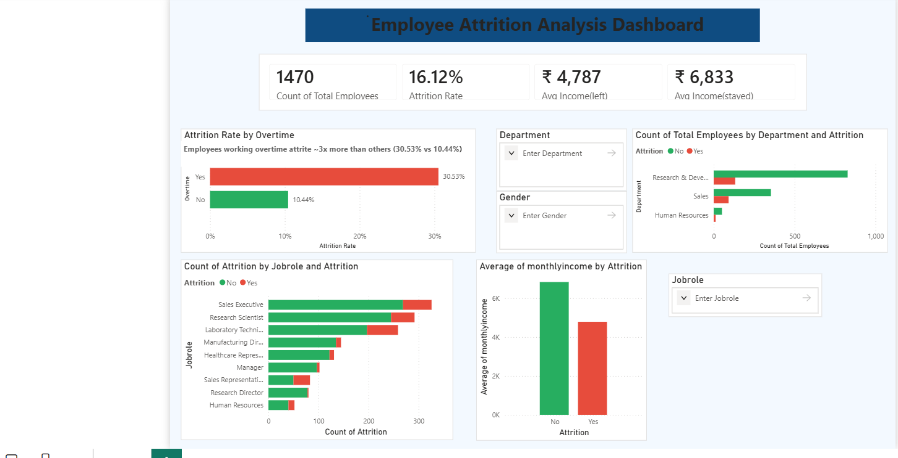

# HR-Attrition-Analysis
End-to-end HR attrition analysis using Python, MySQL, SQL, and Power BI — uncovers key drivers of employee turnover including overtime, income, and department trends. Built on the IBM HR Analytics dataset (1,470 employees).
# HR Attrition Analysis

An end-to-end HR analytics project analyzing employee attrition patterns using the IBM HR Analytics Employee Attrition dataset. The project identifies key drivers of employee turnover through a full data pipeline — from raw data ingestion to an interactive Power BI dashboard — and includes a predictive model to estimate attrition risk.

## 📊 Project Overview
Employee attrition is a costly problem for organizations. This project analyzes 1,470 employee records to uncover the strongest predictors of attrition and presents findings through an interactive dashboard, enabling HR teams to make data-driven retention decisions.

**Key Insight:** Employees working overtime attrite at ~3x the rate of those who don't (30.53% vs 10.44%), and employees who leave earn ~30% less on average than those who stay (₹4,787 vs ₹6,833).

## 🛠️ Tech Stack
- **Python (Pandas)** — data cleaning and ETL
- **MySQL (SQLAlchemy, pymysql)** — data ingestion and storage
- **SQL** — exploratory data analysis
- **Power BI** — interactive dashboard and DAX measures
- **scikit-learn** — predictive modeling (attrition risk prediction)

## 🔄 Workflow
1. **Data Ingestion:** Loaded the IBM HR Attrition CSV into a MySQL database (`hr_attrition`) using Python, SQLAlchemy, and pymysql
2. **Data Cleaning:** Standardized column names, checked for nulls and duplicate employee records
3. **SQL Analysis:** Queried attrition rates by department, job role, overtime status, and income
4. **Dashboard Development:** Built an interactive Power BI dashboard with KPI cards, comparison charts, and dropdown filters
5. **Predictive Modeling:** Built a classification model to predict attrition risk and surface top contributing factors

## 📈 Key Findings
| Metric | Value |
|---|---|
| Total Employees | 1,470 |
| Overall Attrition Rate | 16.12% |
| Attrition Rate (Overtime = Yes) | 30.53% |
| Attrition Rate (Overtime = No) | 10.44% |
| Avg Monthly Income (Left) | ₹4,787 |
| Avg Monthly Income (Stayed) | ₹6,833 |
| Highest Attrition Department | Sales |

## 📁 Repository Structure
HR-Attrition-Analysis/
├── WA_Fn-UseC_-HR-Employee-Attrition.csv   # Raw IBM HR dataset
├── employee_attrition_export.csv          # Cleaned/exported data used in Power BI
├── hr_attrition_analysis.ipynb            # Python ETL, SQL analysis, predictive model
├── hr_attrition.pbix                      # Power BI dashboard
├── Dashboard.png                          # Dashboard preview image
├── LICENSE
└── README.md
## 🖼️ Dashboard Preview

## 🚀 How to Run
1. Clone this repository
2. Set up a MySQL database named `hr_attrition`
3. Update database credentials at the top of `hr_attrition_analysis.ipynb`
4. Run the notebook top to bottom to ingest data, generate SQL insights, and export cleaned data
5. Open `hr_attrition.pbix` in Power BI Desktop to explore the dashboard

## 📬 Contact
**Shiva Kumar**
GitHub: [Shivakumar0406](https://github.com/Shivakumar0406)
LinkedIn: [shivakumar0406](https://linkedin.com/in/shivakumar0406)
Email: shivakumare041@gmail.com
